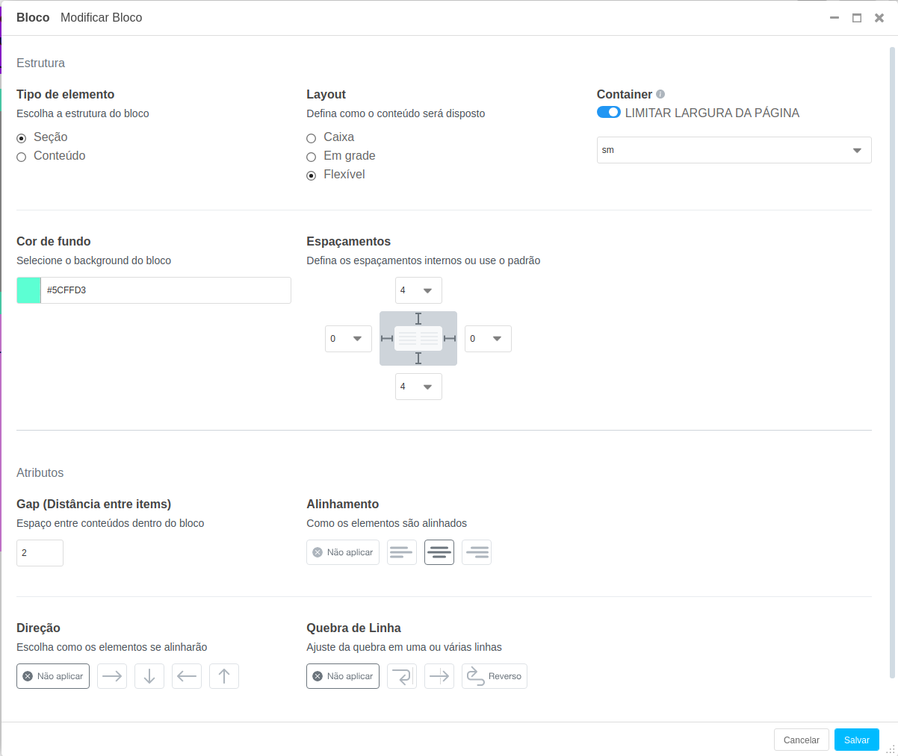

# CMS - Design System (Bootstrap v5)

Sistema base para reaproveitamento de plugins e temas entre os projetos desenvolvidos com o CMS.

## Overview

O Design System possui 3 camadas desenvolvidas em cima dos conceitos do Django CMS usando a biblioteca Bootstrap com SASS para estilizar as páginas.

### Componentes

São plugins (CMS Plugin) mais simples usados para composição de uma página. 

Base de componentes (Átomos):

- AccordionPlugin (contrib.ds.accordion)
- ButtonPlugin (contrib.ds.link)
- CardPlugin (contrib.ds.card)
- CarouselPlugin (contrib.ds.carousel)
- CodePlugin (djangocms_snippet)
- ColumnPlugin (contrib.ds.grid)
- FormPlugin (djangocms_form_builder)
- ImagePlugin (djangocms_picture)
- TextPlugin (djangocms_text_ckeditor)
- VideoPlugin (djangocms_video)

### Bloco e seus Templates

O Bloco é um plugin (CMSPlugin) que representa uma Molécula no Design System, possui plugins filhos que compõem um espaço de conteúdo na Página. Seus atributos configuram cor de fundo, fluxo da renderização de seus filhos e o espaçamento entre os elementos.

Além de suas configurações, quando um Bloco é adicionado diretamente ao [Placeholder](https://docs.django-cms.org/en/latest/introduction/02-templates_placeholders.html#placeholders) é habilitado o atributo *Template*. O Template é uma forma de agilizar a criação de Blocos com conteúdos pré-definidos, como por exemplo um Bloco com duas Colunas de texto ou um Bloco com uma Imagem e um Texto.

[Veja alguns Templates de exemplos](blocks/schemas/)

Para adicionar um novo Template crie um novo arquivo Python na pasta `blocks/schemas` com 2 váriaveis:

- `name`: Nome do template
- `schema`: Dicionário com a configuração do template

Estrutura do schema:

    Raiz
        - *attrs*: Atributos de configuração que serão aplicados no plugin Bloco
        - *children*: Lista com filhos do Bloco

    Filhos
        - *plugin_type*: Nome do Plugin utilizado na renderização
        - *attrs*: Atributos de configuração que serão aplicados nesse plugin
        - *children*: Lista com filhos desse plugin

[Exemplo de Bloco em Grid com 2 colunas (4x8)](blocks/schemas/content_two_cols_4x8.py)

### Tema

Configuração baseada em SASS compilada por [django-compressor](https://django-compressor.readthedocs.io/en/stable/) e que deve ser gerida pelo própio usuário do CMS. Seu objetivo é manipular o estilo dos Sites de maneira sistemática, respeitando a estrutura de plugins que utilizam o Bootstrap para estilização.

Modelo com atributo JSON que após realização de um parse em função chamada `scss` dentro do própio modelo transforma-se em um código SASS que pode ser embedado a página criando uma sobreposição de configurações do Bootstrap.

Inicialmente temos apenas as configurações de Tipografia e Sistema de Cores, mas vale considerar esse espaço para novas configurações sistematicas dos estilos.
