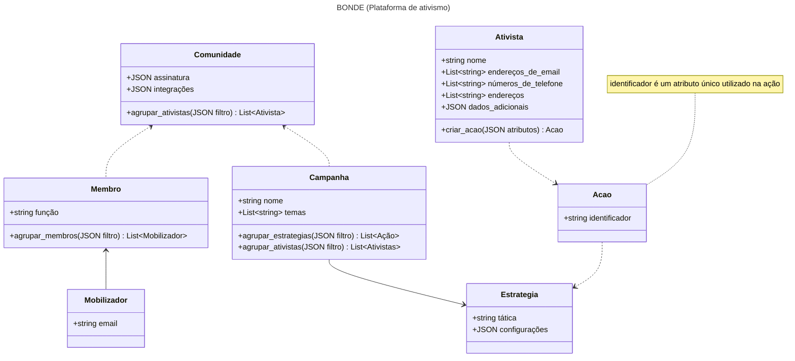

# Bonde (Database / API)
Parte central da plataforma de ativismo, com objetivo de definir modelos de dados e implementações visando simplificar a construção de ferramentas.

Exemplos de ferramentas em desenvolvimento: CMS e BOT
Exemplos de ferramentos integradas: CRM

## Idiomas

**Comunidade:** Modelo grupo, responsável por contextualizar Campanhas, Ações, Mobilizadores e Ativistas

**Mobilizador:** Pessoa capaz de criar e usar diferentes estrategias de Ação para mobilizar Ativistas

**Ativista:** Pessoa que engaja em Campanhas e Ações em prol do interesse coletivo

**Campanha:** Causa projeto que pode utilizar uma ou mais estratégias de Ação para mobilizar Ativistas

**Ação:** Resultado da interação entre o Ativista e uma Estrategia de Campanha

## Modelo de domínio: BONDE (Plataforma de ativismo)

