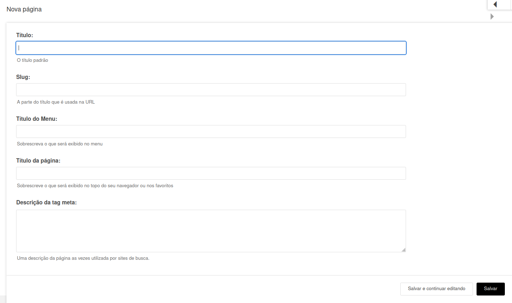
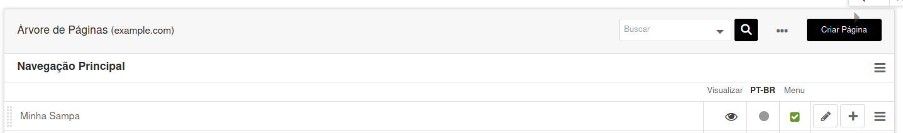
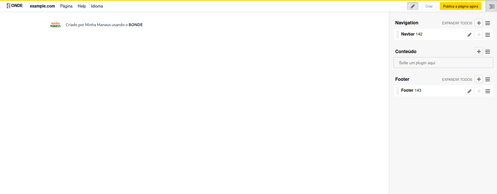
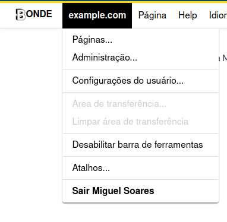
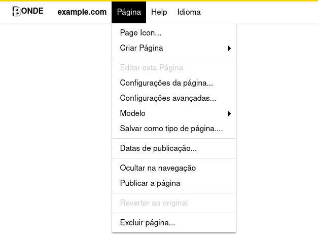
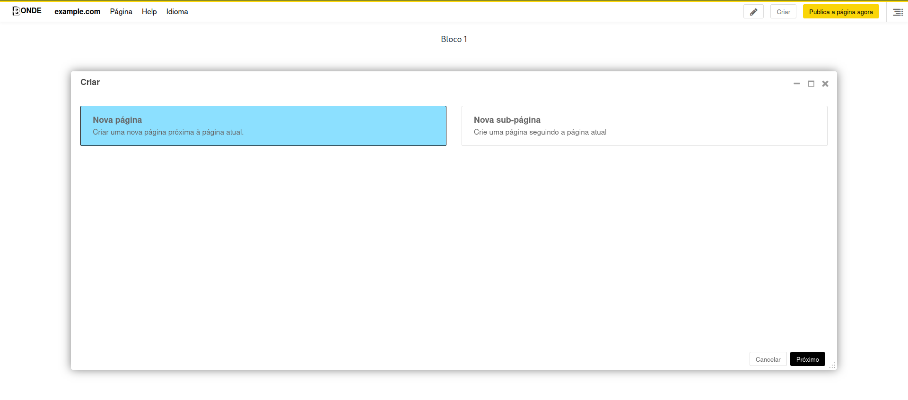
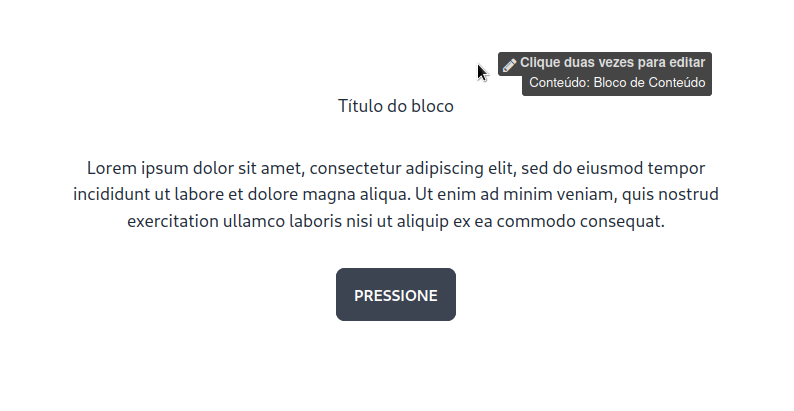

# Apresentando o Editor de Páginas

<!-- TODO: tela principal - criar página - o que são os botões da toolbar - quais são as funcionalidades da sidebar - diferença entre salvar e publicar - ver publicado - adicionar favicon -->

## Login

Para realizar o login, adicione "?edit" ao final da URL em seu navegador. Adicione seu e-mail e senha cadastrados no Bonde no canto superior esquerdo para entrar na plataforma.

## Adicionar nova página

Adicione uma nova página ao clicar em Nova página. No formulário adicione o nome da página e o slug (identificação da página que será utilizada na URL).

## Visualizar e editar a página
Para visualizar sua nova página ou editar páginas existentes, você deverá clicar no ícone referente a Visualizar na tabela. Caso queira editar as informações de nome e slug, utilize o ícone de lápis. Para adicionar novas subpáginas, clique no ícone de +.

## Como editar uma página

## Entendendo a Navbar: example.com

## Entendendo a Navbar: Página

## Criar nova Página ou nova Subpágina

## Salvar e/ou publicar uma página

Quando suas alterações da página não estiverem publicadas, o botão Publicar Página estará disponível. Ao clica-lo, você será redirecionado para a visualização da página publicada. Para voltar a editar, basta clicar no botão Editar.

## Editar conteúdos com dois cliques

Existem duas maneiras de editar um conteúdo dentro da página: navegando pela edição na barra lateral ou clicando duas vezes no conteúdo que você queira editar.

