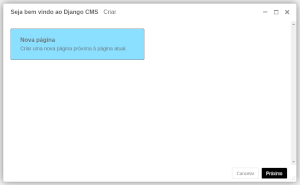
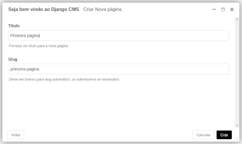

Crie sua primeira página
########################

O assistente de criação de página do CMS abrirá uma nova caixa de diálogo.

Selecione *Próximo* e preencha um Título para a nova página e, em seguidam clique em *Criar*

Aqui está sua página recém-criada, jutamente com a barra de ferramentas do CMS, sua principal ferramenta para gerenciar conteúdo do CMS.