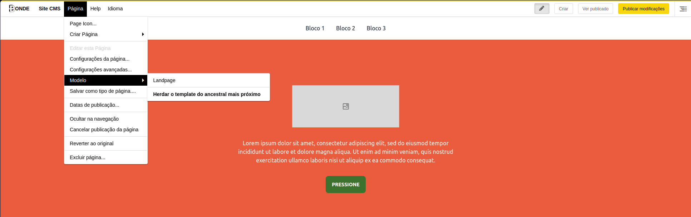
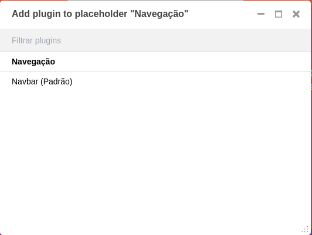
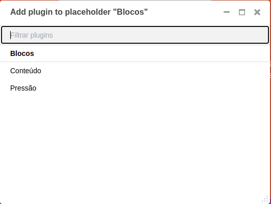
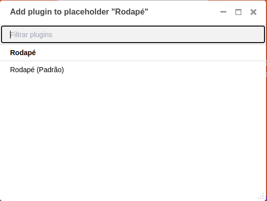

# Modelos

São templates HTML utilizados para personalizar a aparência do seu site, definir *espaços reservados* para seções de conteúdo e muito mais.

Nós podemos definir vários modelos, com diferentes layouts ou componentes integrados, e escolhê-los para cada página conforme necessário. O modelo de uma página pode ser trocado por outro a qualquer momento.

Você encontrará os modelos do site no Toolbar do editor:

## Landpage

Landpage é o nosso modelo padrão para criação de campanhas, e esse modelo possui *3 espaços reservados*.

### Navegação

Só é permitido adicionar plugins do módulo de **Navegação**.

### Conteúdo

Só é permitido adicionar plugins do módulo **Blocos**.

### Rodapé

Só é permitido adicionar plugins de rodapé aqui como o `Rodapé`

